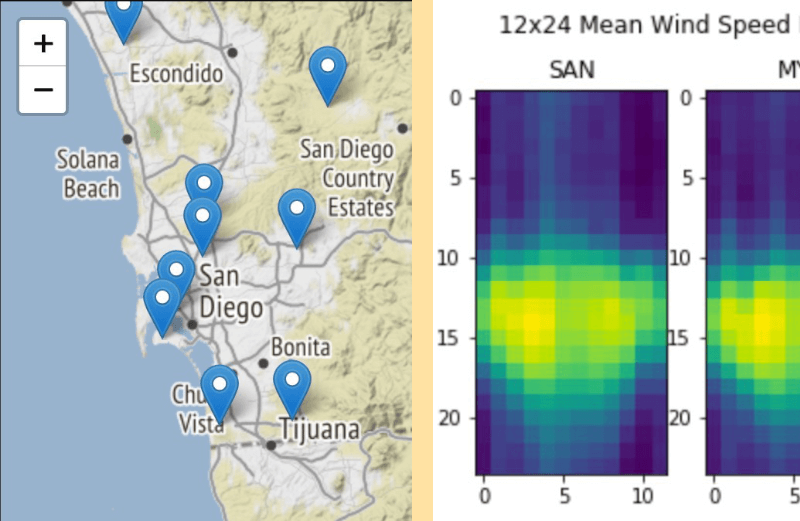
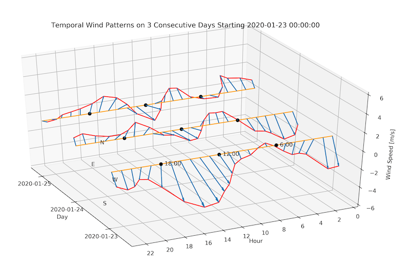
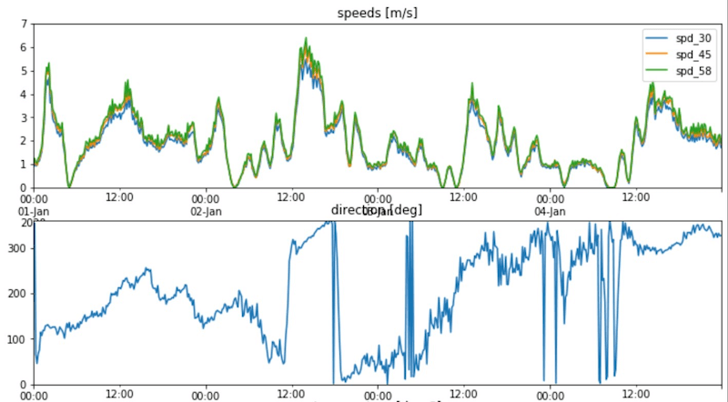

# Predicting the Wind: Data Science in Wind Resource Assessment

This repository contains material for a hands-on tutorial and additional content about data science in wind resource 
assessment. The tutorial was held on 2020-03-11 at the [PyData San Diego Meetup](https://www.meetup.com/PyData-San-Diego/).

### Tutorial
Interactive:  *(recommended start, but may take a bit to load)* – Static: [tutorial_for_self_study.ipynb](./tutorial_for_self_study.ipynb) 

</img>

Hands-on tutorial about data science in wind resource assessment. The tutorial is about the fictitious scenario 
of building a wind farm on the hills around the AI incubator [The Sandbox San Diego](https://www.thesandbox.ai/). Using
Python code, it explains how the wind can be measured and how the measurement can be used together with climate models 
and ground station data to generate a long-term estimate of the wind. Subsequently, the tutorial explores how to use 
that estimate to predict wind turbine power output. Finally, the tutorial puts the output of the fictitious wind 
farm into the broader context of the California power grid.
 
From a data science perspective, the tutorial touches on data exploration, modeling and validation, and clarifies
 where domain knowledge of wind and fluid dynamics can help improve the wind estimate.

The tutorial uses the following tool stack:
 - [Python](https://www.python.org/) for performing calculations
 - [Jupyter Notebook](https://jupyter.org/) as an IDE 
 - [RISE Jupyter extension](https://rise.readthedocs.io/) for presenting the notebook 
 - [hide_code extension](https://github.com/kirbs-/hide_code) for hiding some (long-ish) code to build maps 
 - [Folium](https://python-visualization.github.io/folium/) to display maps
 - [SciPy's](https://www.scipy.org/scipylib/index.html) orthogonal distance regression
 - [scikit-learn's](https://scikit-learn.org) RandomForestRegressor
 - [brightwind](https://github.com/brightwind-dev/brightwind) to support wind resource assessment tasks

### Additional Content: Download and Pre-Process ASOS Data
Interactive:  – Static: [download_and_preprocess_asos_data.ipynb](./data_acquisition/download_and_preprocess_asos_data.ipynb)

</img>

A notebook about how to download and preprocess meteorological data from ASOS measurement stations with Python 
in a Jupyter notebook. In addition to showing how to download the data, the notebook also shows how to quickly produce 
a 12x24 plot with matplotlib and pandas.

### Additional Content: Downloading ERA5 Data in Python
Interactive:  – Static: [downloading_ERA5_data_in_python.ipynb](./data_acquisition/downloading_ERA5_data_in_python.ipynb)

</img>

A notebook that shows how to download and transform ERA5 reanalysis data from the 
[Copernicus Climate Change Service](https://cds.climate.copernicus.eu/cdsapp#!/home) in Python. The notebook is a 
classical example of an ETL process and includes some interesting wind data exploration snippets.

### Additional Content: Synthesizing a (Mock) Wind Speed Time Series
Interactive:  – Static: [synthesizing_a_wind_speed_time_series.ipynb](./data_acquisition/synthesizing_a_wind_speed_time_series.ipynb)

</img>

A Jupyter notebook that deals with how to come up with an artificial met mast time series when you only have some 
reference data and not a lot of time.

### Changelog
- 2020-11-21: Re-worked tutorial to make it more accessible for self-study.
- 2020-03-15: Added information about how to estimate turbine power output with long-term wind estimates.*
